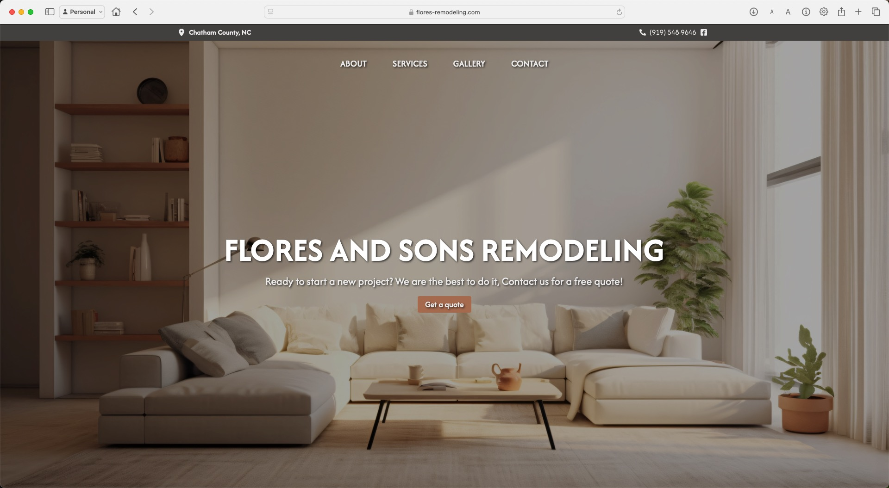

# Remodeling Company

## Website
https://flores-remodeling.com

## Background
A remodeling company that did home renovations at my house didn't have a 
website. I suggested to make them one that showcases their past projects
and allow for potential clients to request for a quote


## Technology
>- Client: React | Typescript
>- Server: Golang

## Directory
```
client/                 contains all files for frontend
    public/             contains all the images used for the client
    src/                contains all source files
        assets/         contains images i.e company logo
        hooks/          contains the use-toast file
        components/     contains components from shadcn, aceternity, etc.
        lib/            contains util.js used for tailwind css
        pages/          contains the pages of the website
        
server/                 contains all files for the backend
    client.go           file that contains client struct of the db
    database.go         file that contains the database requests
    main.go             file that contains the functions for the REST api
```

## Installation
You can install the project using the following command
```
git clone https://github.com/c-lorenzo76/remodeling-co.git
```

## Start the client
In the terminal run the commands to start the server, and it will run on localhost:5173
```
cd client/
npm install 
npm start
```

## Start the server
In another terminal, run the following commands to create a shell script file within the 'server/' directory
```
cd server/
touch server.sh
nano server.sh
```
Then add the following information to the shell script
```
#!/bin/zsh
export SMTP_HOST=""
export SMTP_USER=""
export SMTP_PASS=""

export DBUSER=""
export DBPASS=""
export DBADDR=""
export DBNAME=""

echo "Building the server application..."
go build -o server

echo "Starting the application..."
./server
```
Then run the file by the shell script file name, it will run on localhost:8080
```
./server.sh
```

## Landing page



